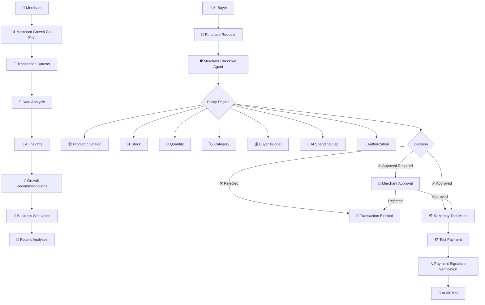

# 🚀 Merchant Growth Co-Pilot + Merchant Checkout Agent

## Technical Documentation & Local Setup

> A merchant intelligence platform combined with a policy-controlled AI commerce checkout layer.

---

## 📌 What This Repository Contains

This repository contains two connected experiences:

### 📊 Merchant Growth Co-Pilot

The existing React-based merchant analytics application.

It helps merchants:

* Analyze transaction datasets
* Diagnose revenue performance
* Identify revenue leaks
* Generate AI-powered insights
* Get growth recommendations
* Simulate potential business fixes
* Track previous analyses

### 🤖 Merchant Checkout Agent

A separate AI-commerce experience designed to demonstrate how merchants can safely handle AI-initiated purchase requests.

It introduces a controlled layer between:

```text
AI Buyer
    ↓
Merchant Checkout Agent
    ↓
Policy Engine
    ↓
Merchant Approval
    ↓
Razorpay Test Mode
    ↓
Audit Trail
```

The existing Merchant Growth Co-Pilot remains the primary analytics experience, while the Checkout Agent provides a separate AI-commerce workflow.

---

# 🧠 Core Concept

Traditional commerce:

```text
Human
  ↓
Website
  ↓
Checkout
  ↓
Payment
```

AI-driven commerce:

```text
Human
  ↓
AI Buyer
  ↓
Merchant
  ↓
Merchant Checkout Agent
  ↓
Policy-Controlled Transaction
  ↓
Payment
  ↓
Audit Trail
```

The Checkout Agent exists to ensure that an AI agent cannot directly and unrestrictedly execute financial transactions.

Instead, every purchase request is evaluated against merchant and buyer policies before payment.

---

# 📂 Project Structure

```text
Merchant-Growth-Copilot-With-Checkout-Agent/
│
├── frontend/
│   ├── public/
│   ├── src/
│   ├── package.json
│   └── ...
│
├── merchant-checkout-agent/
│   └── index.html
│
├── merchant-checkout-agent-backend/
│   ├── package.json
│   ├── server.js
│   ├── .env.example
│   └── ...
│
└── README.md
```

The repository keeps the existing frontend separate from the Checkout Agent frontend and backend.

---

# 🏗️ System Architecture



---

# 🔄 Merchant Growth Co-Pilot Flow

```text
📁 Upload Dataset
       ↓
🔎 Analyze Transactions
       ↓
📈 Diagnose Revenue
       ↓
🧠 Generate AI Insights
       ↓
💡 Recommend Fixes
       ↓
🧪 Simulate Business Impact
       ↓
📊 Review Expected Outcome
       ↓
📝 Save to Recent Analyses
```

The existing dashboard provides dataset analysis, revenue diagnostics, AI-generated insights, growth recommendations, business simulations, fix recommendations, and persistent recent analyses.

---

# 🤖 Merchant Checkout Agent

The Checkout Agent is accessible from the Merchant Growth Co-Pilot through:

```text
AI Checkout Agent →
```

This opens:

```text
/merchant-checkout-agent/index.html
```

The Checkout Agent also provides navigation back to the Merchant Growth Co-Pilot and an Audit Trail.

---

# 🔐 Complete Checkout Flow

Every AI purchase follows a controlled sequence:

```text
🤖 AI Buyer
     ↓
🛒 Purchase Request
     ↓
🛡️ Merchant Checkout Agent
     ↓
📦 Catalog Validation
     ↓
📊 Stock Validation
     ↓
🔢 Quantity Validation
     ↓
🏷️ Category Validation
     ↓
💰 Buyer Budget Check
     ↓
🚨 AI Spending Cap
     ↓
🔐 Authorization Check
     ↓
👤 Merchant Approval
     ↓
💳 Razorpay Test Order
     ↓
💳 Razorpay Test Payment
     ↓
🔍 Payment Signature Verification
     ↓
📜 Audit Trail
```

This is the documented transaction lifecycle for the Checkout Agent.

---

# 🛍️ Agent-Readable Catalog

The Checkout Agent evaluates merchant product information before allowing a purchase.

The catalog can contain:

| Field                 | Purpose                          |
| --------------------- | -------------------------------- |
| Product Name          | Identifies the requested product |
| Price                 | Determines transaction value     |
| Stock                 | Determines availability          |
| Category              | Used for category restrictions   |
| Quantity Constraints  | Controls permitted quantity      |
| Purchase Restrictions | Additional purchase rules        |

This allows the agent to evaluate a purchase request before initiating payment.

---

# 🛡️ Policy Engine

The policy engine is the main safety layer.

## 📦 Product Validation

The requested product must exist in the available catalog.

```text
Product exists?
     │
 ┌───┴───┐
Yes      No
 │        │
 ▼        ▼
Next    ❌ Reject
```

---

## 📊 Stock Validation

The requested quantity must be available in stock.

```text
Requested Quantity
        ↓
Available Stock
        ↓
    Compare
     ↙   ↘
Enough   Not Enough
  ↓          ↓
Next       ❌ Reject
```

---

## 🔢 Quantity Validation

The requested quantity must satisfy the configured quantity restrictions.

---

## 🏷️ Category Validation

The product must belong to an allowed category.

---

## 💰 Buyer Budget Check

The transaction must remain within the buyer's specified budget.

Example:

```text
Buyer Budget:     ₹3,000
Purchase:         ₹2,500

Result:           ✅ Allowed
```

---

# 🚨 AI Spending Cap

The Checkout Agent demonstration implements a hard AI transaction limit of:

# ₹3,000

Requests above this amount are declined before payment.

### Example

```text
AI Purchase Request
        ↓
Transaction = ₹3,600
        ↓
AI Limit = ₹3,000
        ↓
₹3,600 > ₹3,000
        ↓
❌ Transaction Declined
        ↓
💡 Reduce Quantity
```

The ₹3,000 limit is part of the documented demonstration configuration.

---

# 👤 Merchant Approval

Transactions above:

# ₹2,000

require explicit merchant approval before a Razorpay order can be created.

```text
Transaction
     ↓
Amount Check
     │
 ┌───┴─────────────┐
 │                 │
≤ ₹2,000         > ₹2,000
 │                 │
 ▼                 ▼
Continue      Merchant Approval
                   │
              ┌────┴────┐
              │         │
           Approve    Reject
              │         │
              ▼         ▼
          Payment     Blocked
```

The approval threshold is documented as ₹2,000.

---

# 🔐 Authorization

The Checkout Agent uses a one-time authorization mechanism for the demonstration transaction flow.

The authorization is consumed only as part of the controlled checkout process.

---

# 💳 Razorpay Test Mode

Approved transactions can create a Razorpay Test Mode order through the backend.

The backend is responsible for handling Razorpay secret credentials.

### Important

The frontend must **never contain**:

```text
RAZORPAY_KEY_SECRET
```

Only the backend should access the secret credential.

---

# 🔑 Environment Configuration

Create a `.env` file inside:

```text
merchant-checkout-agent-backend/
```

Example:

```env
RAZORPAY_KEY_ID=rzp_test_...
RAZORPAY_KEY_SECRET=...
PORT=5001
FRONTEND_ORIGIN=http://localhost:3000
```

Use **Razorpay Test Mode credentials** for development and demonstration.

### ⚠️ Never commit `.env`

Make sure your `.gitignore` contains:

```text
.env
```

The documented project configuration uses the variables above and explicitly requires Razorpay Test Mode credentials.

---

# 🚀 Running Locally

## Prerequisites

Make sure you have:

* Node.js
* npm
* Git
* Razorpay Test Mode credentials

---

## 1️⃣ Start the React Frontend

Open a terminal:

```bash
cd frontend
npm install
npm start
```

The frontend runs at:

```text
http://localhost:3000
```

---

## 2️⃣ Start the Checkout Agent Backend

Open a **second terminal**:

```bash
cd merchant-checkout-agent-backend
npm install
```

Create the environment file:

```bash
copy .env.example .env
```

Then edit `.env` and add your Razorpay Test Mode credentials.

Start the backend:

```bash
npm start
```

Backend:

```text
http://localhost:5001
```

These are the documented local frontend/backend setup steps.

---

# 🔗 Connecting the Two Experiences

The Merchant Growth Co-Pilot contains:

```text
AI Checkout Agent →
```

Clicking it opens:

```text
/merchant-checkout-agent/index.html
```

The Checkout Agent contains a:

```text
Merchant Growth Co-Pilot
```

link that returns to the main merchant application.

This keeps the existing merchant analytics experience intact while adding the AI-commerce experience.

---

# 🌐 Deployment

The React frontend is deployed using Render.

### Live Application

**https://merchant-growth-copilot-razorpay.onrender.com**

The frontend deployment is separate from the Checkout Agent backend.

The backend can be deployed independently and connected to the frontend through the appropriate backend URL and environment configuration.

---

# 🛠️ Technology Stack

### Frontend

* React.js
* JavaScript
* HTML
* CSS

### Backend

* Node.js
* Express.js

### Payments

* Razorpay Test Mode

### Deployment

* Render

### Version Control

* Git
* GitHub

---

# 🌱 Future Scope

The current project demonstrates the concept of **controlled AI commerce**.

Potential future improvements include:

### 🤖 AI Commerce

* Multi-merchant AI commerce
* Advanced AI purchasing agents
* Agent-to-agent commerce
* AI commerce protocols

### 🛡️ Security & Risk

* Dynamic spending limits
* Fraud detection
* Risk scoring
* Role-based merchant approvals
* Advanced authorization policies

### 🏪 Merchant Infrastructure

* Persistent transaction database
* Merchant-specific policy engines
* Inventory reservation
* Order management
* Refund and cancellation workflows

### 💳 Payments

* Production payment integrations
* Multiple payment gateways
* Advanced payment verification

These represent possible extensions of the current demonstration.

---

# 🎯 Project Vision

The long-term vision is to prepare merchants not only for today's human-driven commerce, but also for tomorrow's AI-driven transactions.

```text
                 👤 HUMAN
                    │
                    ▼
                🤖 AI BUYER
                    │
                    ▼
                 🏪 MERCHANT
                    │
                    ▼
        🛡️ MERCHANT CHECKOUT AGENT
                    │
                    ▼
          ⚙️ POLICY-CONTROLLED
              TRANSACTION
                    │
                    ▼
                💳 PAYMENT
                    │
                    ▼
              📜 AUDITABILITY
```

The two parts of the project work together:

```text
📊 Merchant Growth Co-Pilot
            │
            │
            ▼
    Understand & Grow
            │
            ▼
     Prepare for AI
            │
            ▼
🤖 Merchant Checkout Agent
            │
            │
            ▼
    Control AI Actions
            │
            ▼
      Safe Transactions
```

### **The Growth Co-Pilot helps merchants understand and grow their business.**

### **The Checkout Agent helps merchants participate in AI-driven commerce while retaining control.**

---
